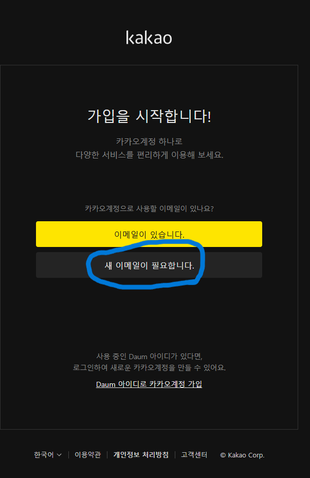
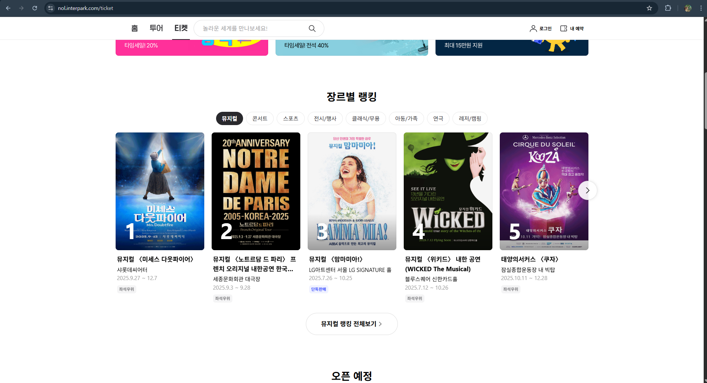
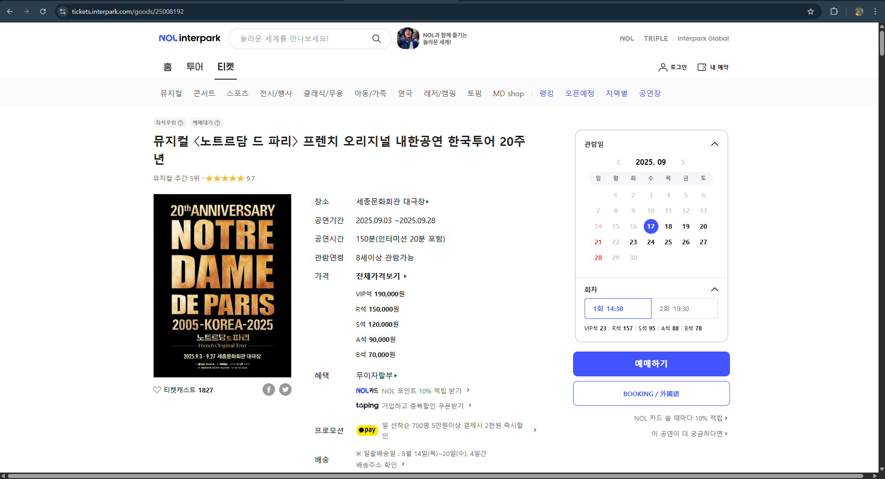

This file explains how to use the program.

1. First, clone the project using git clone.

2. In macro.py, find the section where you need to input:
KAKAO_EMAIL = ''      
KAKAO_PASSWORD = ''  
PERFORMANCE_UUID = 
TARGET_MONTH = 
TARGET_DAY = 
(This section is located at the top of the file.)

Each variable means the following:

KAKAO_EMAIL (KakaoTalk login email)   
KAKAO_PASSWORD = (KakaoTalk login password)  
PERFORMANCE_UUID = (Unique ID of the performance to book)
TARGET_MONTH = (Which month to book)
TARGET_DAY = (Which day to book)

2-1. If you don't have a KakaoTalk account, please create one at the link below. (It's a famous Korean service company, so don't worry.)
https://accounts.kakao.com/weblogin/create_account/?continue=https%3A%2F%2Faccounts.kakao.com%2Fweblogin%2Faccount&lang=ko&showHeader=false#selectVerifyMethod

2-2. You can find the performance UUID on the ticketing website. First, go to the link below and select the performance you want. Then check the numbers at the end of the address bar.
https://nol.interpark.com/ticket

3. When the month and date are properly selected and the ticket purchase detail popup appears, the captcha will be checked.
Here, the macro cannot detect the captcha input, so the user needs to click the captcha input button once.

4. For seat selection, 2nd and 3rd floor seats have been excluded because they may or may not work depending on the computer environment. We will fix this issue and update it later.
